# Structural audit

1. Understand the entity relationships currently embodied in the BRAIN Diet documents.
2. Work out for each entity what:
  - The required front matter should be.
  - What sections the document should contain.
3. Audit the validation scripts - Explain what they're all for.  Are they:
   - One-off scripts written for some purpose that we don't need anymore
   - Scripts to ensure the structure, which we should automate and run every time.
   - Scripts to set up the structure or produce reports, which we should probably also run every time.
   - Old rubbish.
4. Compare the validation scripts with the ER / document structures - what's missing?
5. Run the validation.  What's broken? What's missing? What's extra? What's duplicated?  Then we fix it.

## Entity relationship diagram

Relationships follow the documentation causality chain (via tags), BRS mechanism structure, and the `docs/` folder layout.

```mermaid
erDiagram
    Recipe ||--|{ Food : "contains (tagged)"
    Food ||--|{ Substance : "contains (tagged)"
    Substance }o--|{ BRS : "supports (tagged)"
    Substance }o--o{ PrimaryMechanism : "supports (tagged)"
    Substance }o--o{ SpecificMechanism : "supports (tagged)"

    BRS ||--o{ KeyConstraint : "KC"
    BRS ||--o{ FunctionalMechanism : "FM"
    FunctionalMechanism ||--|{ PrimaryMechanism : "covers (tagged)"
    FunctionalMechanism ||--|{ SpecificMechanism : "covers (tagged)"
    KeyConstraint }o--o{ PrimaryMechanism : "constrains"

    PrimaryMechanism }o--|{ Phenome : "phenome_relationships"
    FunctionalMechanism }o--|{ Phenome : "functional_outcome_context"

    Recipe {
        string title PK
        string list_image
        string meal_slot
    }

    Food {
        string title PK
        string list_image
        object nutrition_per_100g
        object nutrition_source
        object nutrition_supplementary_sources
    }

    Substance {
        string title PK
        string list_image
        string inchikey
        object mechanisms
        string classification "Nutrient Bioactive MicrobialMetabolite"
        string folder "nutrients bioactive-compounds microbial-metabolites"
    }

    BRS {
        string id PK "BRS1..BRS6 or BRS-X"
        string title
        string list_image
        string hub_path "docs/biological-targets/"
    }

    KeyConstraint {
        string id PK
        string path "docs/biological-targets/brsN/kc"
    }

    PrimaryMechanism {
        string id PK
        string path "docs/biological-targets/brsN/fmN/*pm*"
        object phenome_relationships
    }

    FunctionalMechanism {
        string id PK
        string path "docs/biological-targets/brsN/fmN"
        object functional_outcome_context
    }

    SpecificMechanism {
        string id PK
        string path "docs/biological-targets/brsN/sm"
        string category "SNP CROSS Sex Lifestage Pattern"
    }

    Phenome {
        string id PK "PH001.."
        string title
        string domain
    }
```

## Causality chain (summary)

| From | Relationship | To | How encoded |
| --- | --- | --- | --- |
| Recipe | contains | Food | Front-matter tags (food name) |
| Food | contains | Substance | Front-matter tags (substance name) + nutrition table |
| Substance | supports | BRS | Front-matter tags + `mechanisms` |
| Substance | supports | PM / SM | Front-matter tags |
| BRS | decomposes into | KC / FM | Folders under `docs/biological-targets/brsN/` |
| FM | covers | PM / SM | Tags (BRS membership inferred via FM) |
| PM / FM | maps to | Phenome | `phenome_relationships` / `functional_outcome_context` front matter |

## Folder → entity map

| `docs/` folder | Primary entity | Action |
| --- | --- | --- |
| `recipes/` | Recipe | keep |
| `foods/` | Food | keep |
| `substances/` | Substance (`nutrients/`, `bioactive-compounds/`, `microbial-metabolites/` = classification, not separate entities) | keep |
| `biological-targets/` | **BRS** hub pages + KC / PM / FM / SM | keep |
| `therapeutic-areas/` | — | **remove** |
| `phenomes/` | Phenome (registry-backed detail pages) | keep |
| `papers/` | — (single bibliography page, not a domain entity) | **remove** |
| `dietary-foundations/` | — (not a domain entity) | **remove** |
| `tags.yml` | Relationship encoding (not an entity) | keep |
| `system/` | Meta / schema docs (not domain entities) | keep |

## Notes

- **Tags are not entities.** They are how many relationships above are formed: each related entity name is listed in front-matter `tags:` (registered in `docs/tags.yml`), and list/matrix components resolve those links.
- Foods should tag **intrinsic** substances only (not downstream metabolites such as SCFAs produced by fermentation).
- **BRS** (Biological Regulatory System) is the hub entity under `docs/biological-targets/` — BRS1–BRS6 plus BRS-X. Older docs/AGENTS wording “biological target” usually means a BRS hub (or an FM within it).
- BRS layers: **KC** = Key Constraint, **PM** = Primary Mechanism, **FM** = Functional Mechanism (principal biological targets of the framework), **SM** = Specific Mechanism (context/interpretation). PM and SM attach to FM via tags (not directly to BRS); BRS membership is inferred through FM. Phenomes sit above mechanisms as functional outcomes.
- Substance subclasses (Nutrient / Bioactive / Microbial metabolite) are folder + tag classifications on Substance, not separate relationship endpoints.
- Citations stay as anchors into bibtex (`static/bibtex/BRAIN-diet.bib`); they are evidence, not a modelled entity.
